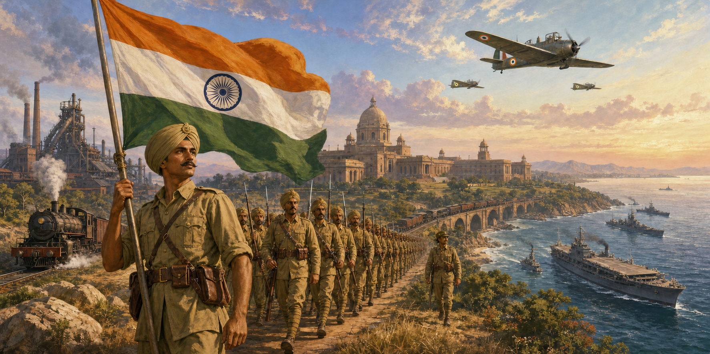
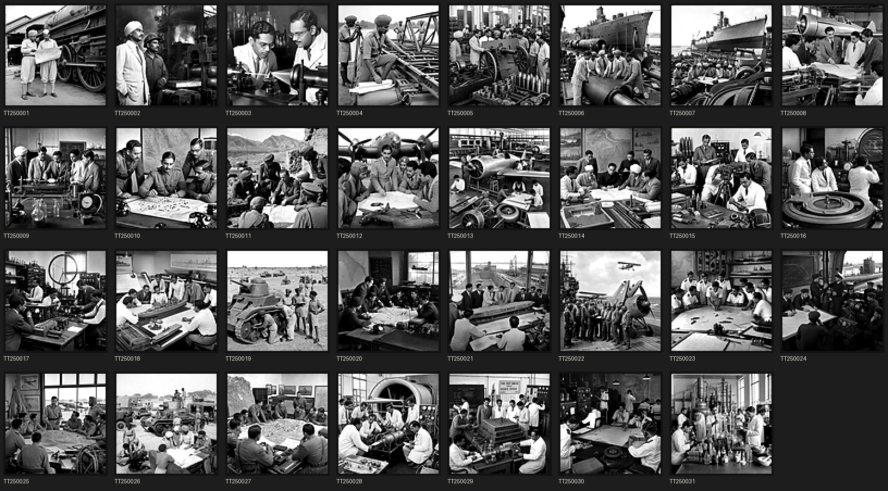
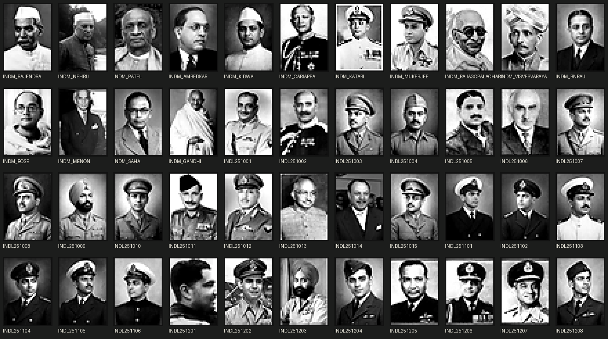
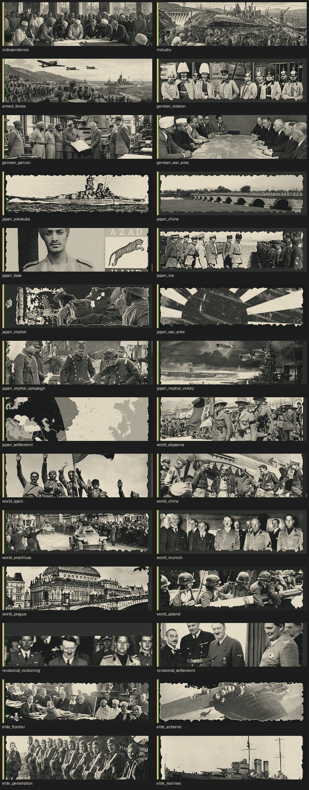
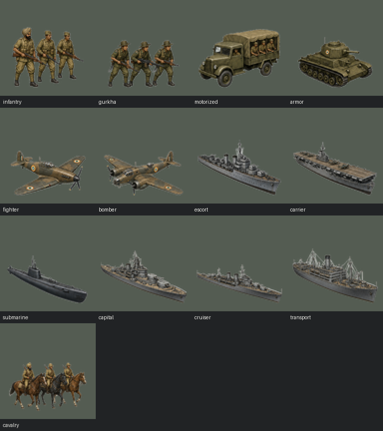

# A Union Before Midnight



**An independent India alternate-history campaign for Darkest Hour, beginning on 1 January 1933.**

A Union Before Midnight asks a simple question: what if the British Raj transferred
power before the global crisis of the 1930s, leaving a united but unsettled
Indian state to choose its own place in the world?

*Freedom came early. Unity came at a price.*

India begins sovereign from Delhi to Rangoon. It has enormous potential, weak
institutions, uneven infrastructure and an inherited military that is large on
paper but not ready for modern war. Political bargains, industrial investment,
research institutions and strategic commitments can turn it into the world's
second- or third-ranked power, but no route grants an automatic victory.

## Requirements

- Darkest Hour 1.05.2
- Darkest Hour Full, included with the game
- A new 1933 campaign

This repository contains only the **A Union Before Midnight overlay**. It does not
redistribute Darkest Hour. Players do not need Blood and Iron to run an already
built local installation. Rebuilding the personal animated-sprite overlay does
require Blood and Iron v1.1 to be installed locally; the pipeline imports those
assets and records their provenance. The donor binaries require author
permission before redistribution.

## Installation

1. Install Darkest Hour.
2. Download and extract the latest A Union Before Midnight release.
3. Run `INSTALL.bat`.
4. Select **A Union Before Midnight V4.2** in the Darkest Hour launcher.
5. Start **A Union Before Midnight: India 1933** in the scenario list.

The installer detects the standard Steam location, verifies every overlay file,
copies Darkest Hour Full into an isolated mod folder and applies A Union Before
Midnight content. Existing saves in that mod folder are preserved during updates.
Public installer manifests exclude copied foundation files, donor map payloads,
donor-derived sprites and palettes, donor-derived model panels, unresolved art,
temporary QA material and private test state. A developer build may reconstruct
personal sprites from the user's own installed mods without committing those
binaries.

For a non-standard Steam library:

```powershell
powershell -ExecutionPolicy Bypass -File installer\Install-A-Union-Before-Midnight.ps1 `
  -GameRoot "D:\SteamLibrary\steamapps\common\Darkest Hour A HOI Game"
```

For development, `BUILD_AND_DEPLOY_V4.bat` performs the complete public rebase,
repeat-build stability check, static audit, manifest generation and verified
deployment. Passing `-ValidateOnly` rebuilds and audits without touching the
installed mod. Developers with their own Blood and Iron v1.1 installation may
add `-IncludePersonalSprites` to build and validate the local-only visual
overlay; the default remains donor-free.

## V4 Direct-DH Alpha

V4 rebases the campaign directly onto Darkest Hour Full and removes the
Blood and Iron runtime dependency. It adds a grounded union-integration layer,
global reactions, operational command, procurement and war-settlement systems.

Air and naval combat now emphasizes organization loss and withdrawal over
routine destruction. Twelve three-division field corps, faster prepared
reserves, airfield security, dispersal fields and scramble missions reduce
wartime micromanagement within the limits of the Darkest Hour executable.

Alpha 19 is the 1933 launch and public-snapshot hotfix. It removes 116
unsupported country-tag wrappers around Darkest Hour's global flags, adds a
regression validator for that parser failure and has been smoke-tested from a
fresh launch through the live India map.

Alpha 18 completed wartime play around a canonical War Cabinet. Allied, German,
Soviet, Japanese and sovereign routes each receive a four-doctrine war charter,
measurable battlefield achievements and a postwar Delhi congress. Great-power,
regional and 210 generated country campaigns now open from live world state,
survive reversals, permit country-specific armistices and require an explicit
constitutional settlement after annexation. Together with 26 bespoke opponents,
India can prosecute 236 country-specific campaigns without committing to a
permanent bloc. Coalition transfer, partner collapse and Bitter Peace now
preserve India's verified battlefield ledger. Mobilisation, annual war budgets,
cumulative debt and scalable, reducible occupation upkeep make conquest
consequential.

Alpha 16's disclosed diplomatic odds and Alpha 15's specialist equipment,
naval, command and research improvements remain intact.

For a player-facing explanation of the complete campaign loop, route choices,
war economy, mobilisation, settlement rules, verification status and remaining
playtest risks, see [Gameplay Changes and Alpha 19 Status](GAMEPLAY_CHANGES.md).

## Campaign

- **4,343 campaign entries** across 56 isolated event modules: 3,706 Indian
  events and decisions plus 637 foreign replies.
- **103 player-timed decisions** and **4,240 events** for deadlines, crises,
  negotiations, implementation disputes, objectives and settlements.
- Stable constitutional governments, complete cabinets and leadership
  transitions tied to genuine political milestones.
- **Five strategic universes:** Allied, German, Japanese, Soviet and armed
  non-alignment.
- A permanent War Cabinet can join or leave formal coalitions, preserve
  separate-command compacts, declare an independent war against every modeled
  sovereign state and inspect every live theatre.
- Route-specific wartime charters turn battlefield objectives into political
  standing, then convert a completed war into a sovereign concert, security
  sphere or renewed strategic autonomy at a Delhi peace congress.
- Every major, regional and fallback opponent has a campaign brief, live
  objective, reversal, recovery, armistice response and post-annex settlement;
  old prerequisite chains no longer silently erase a campaign.
- Formal Allied, German, Soviet and Japanese alliances have deterministic
  precedence, explicit entry, clean side-switching and sovereign fallback if a
  strategic partner disappears.
- Japan follows an independent India-facing route around China, Bose, the INA,
  Imphal, Burma and Asian leadership rather than acting as an appendage of
  Germany.
- Indian responses to Abyssinia, Spain, China, Anschluss, Munich, Prague,
  Albania and the invasion of Poland.
- Meaningful choices that trade money, supplies, manpower, dissent, autonomy
  and diplomatic freedom for distinct rewards.
- Annual wartime finance, cumulative debt, emergency credit, national service,
  scalable occupation upkeep, logistics, science, civil liberty, veterans and
  industrial reconversion.
- Postwar and Cold War content through 1964.

## Industry And Forces

- Core 1933-1940 provincial IC range of **150-209**, with a representative
  middle route of 182 and further wartime expansion.
- Resource development based on the actual oil, coal, iron, chromite and
  manganese belts of the subcontinent.
- Event-supported **67-108 effective land formations**, **10-18 air wings** and
  **14-31 naval formations** by 1940 before ordinary player queues and
  strategic-path bonuses.
- Arabian Sea, Bay of Bengal and Indian Ocean commands.
- Zero to two naval-aviation ships by 1940 and one to three by 1942,
  depending on doctrine.
- Gurkhas, frontier forces, airborne formations, long-range penetration groups
  and Andaman marine charters.
- Eight separately researchable Indian special-unit types and two half-built
  super-heavy capital ships unlocked through late naval programmes.
- An optional developer-only overlay reconstructs **41 distinct India sprite
  families** with eight-direction movement and multi-frame combat animation;
  public builds inherit Darkest Hour Full map sprites.
- Complete Indian naming pools for corps, divisions, air groups, wings, fleets,
  ships, submarines, transports and missiles.

## Research And Leadership

- **31 technology teams** covering industry, medicine, armour, aircraft,
  carrier aviation, naval doctrine, radar, signals, rocketry and atomic
  science.
- Historically researched and plausibly embellished traits for ministers,
  commanders and technology teams.
- Staged military promotions and service development rather than a fully
  modern command structure on day one.
- Bespoke team art and a documented distinction between archival portraits and
  plausible painted reconstructions.





## Visuals And World Events

V4 includes 102 byte-distinct custom event pictures covering the political
routes, global crises, campaign system and elite formations. Generated scenes
are explicitly disclosed as alternate-history reconstructions rather than
archival photographs. The event-ID manifest, source sheets and review galleries
are included in the repository.



Public builds inherit Darkest Hour Full unit sprites and production panels. A
developer-only local build can reconstruct 41 animated Indian sprite families
from installed donor material, but those descriptors, animation strips,
palettes and donor-derived model panels are excluded from public manifests and
are not cleared for redistribution. Every donor path and hash is recorded in
the generated personal sprite manifest.



India's eight special-unit families retain their gameplay, localization,
counters and technology ladders. Original redistribution-safe India sprites
and model panels remain future art work. Cleared India-specific counters,
portraits, event art and flags remain part of the direct-DH package; copied
foundation/donor map payloads and unresolved visual overrides do not.

India can react to the major crises of the 1930s and pursue separate Allied,
German, Japanese, Soviet or armed non-aligned strategic relationships.

## Reliability

The release pipeline rejects:

- malformed events, duplicate IDs and unsupported commands;
- unsupported foreign-country trigger scopes inside event commands;
- non-owned or geographically invalid construction targets;
- infrastructure above 100 and air or naval bases above level 10, including
  construction already in progress;
- event force serials that lack the manpower required by Darkest Hour;
- advanced units queued before their type and model are enabled;
- invalid or display-string-less division attachments;
- missing event pictures and malformed personnel records;
- strategic paths that fail the deterministic economy and force-plan gates;
- any file matching the nonredistributable or personal-overlay deny lists.

The V4 build pipeline also verifies the opening treasury, event-built unit
availability, combat pacing, cumulative construction caps and every installer
file hash before deployment.

See [Release Notes](RELEASE_NOTES.md), [Design Notes](docs/DESIGN.md) and
[Art and Research Credits](docs/ART_AND_RESEARCH_CREDITS.md). The complete
[event/decision policy](docs/EVENT_AND_DECISION_DESIGN.md) and
[row-by-row audit](docs/event_decision_audit.csv) are also included. The
[forum release audit](docs/FORUM_RELEASE_AUDIT.md) records the remaining
permission and moderator-approval work.

Current playtest changes are summarized at the top of the release notes. Steam
Deck controls, installation standards and hardware checks are documented in the
[Steam Deck Product Standard](docs/STEAM_DECK.md).

## Compatibility

- A new campaign is required for the intended force, economy, route and
  research curve.
- V3 saves are not supported by V4.
- Other mods that replace the Darkest Hour Full 1933 scenario, India data or
  global event files are not supported.

## Credits

Design and India-specific content by **Mohsin Dingankar**, developed with Codex
collaboration.

V4 is built directly on the user's installed **Darkest Hour Full** foundation.
V3 was developed against Blood and Iron; that historical dependency is not
redistributed or required by V4. See the full
[credit and provenance record](docs/ART_AND_RESEARCH_CREDITS.md).

Darkest Hour and Hearts of Iron are trademarks of their respective owners.
This is a non-commercial fan modification and is not affiliated with or
endorsed by the original publishers.

## Rights

This is a mixed-origin fan project. No blanket licence is granted over
third-party game or mod assets. See [RIGHTS.md](RIGHTS.md) before redistributing
or incorporating material into another project.

