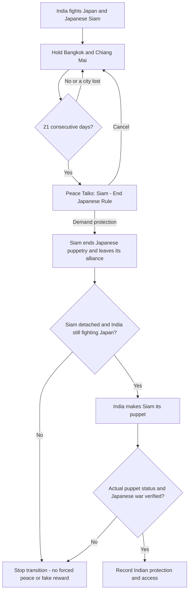
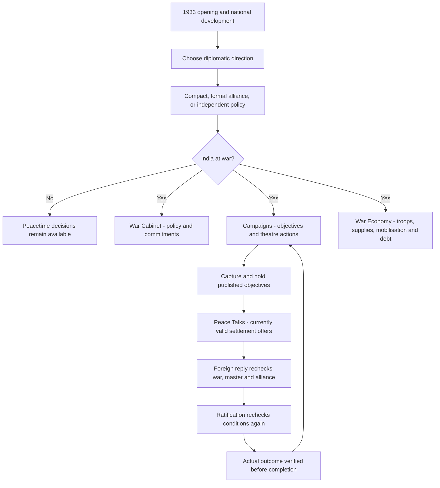

# 27-CLEANUP1: safer settlements and a smaller wartime panel

This is a **playtest patch**, not an engine-certified release. The installation
receipt, when present, is `CLEANUP1.json` in the selected mod folder. The loading
and opening menu badge reads `27-CLEANUP1`; a one-time campaign notice confirms
that the new event code is loaded. The base remains Alpha 27 with the existing
terrain work and LIBERATOR3 campaign content.

Installed locally on **8 September 2026** in `Mods/AUBM Terrain Prototype P1`:
111 payload files verified, 98 changed with backups. The final package passed
**144 regression tests**, zero compiled presentation checks failed, and the
base-source validator reported zero errors and zero warnings. The original
autosave was preserved; `CLEANUP1_India_1942-02-01.eug` was created separately.
Backup: `tmp/cleanup1-install-20260908T155100Z`. No engine playtest was performed.

## What changes

| Area | Implemented change |
|---|---|
| Siam | Hold Bangkok and Chiang Mai for 21 days, then demand Siam leave Japan and become an Indian puppet. The government change is executed from Siam first, followed by separate verification before Indian protection. |
| Peace scope | Generic local negotiations reject puppets and allied opponents. India must be independent and either outside an alliance or its leader. Guarded Indian settlements use full peace, not the separate-peace command that could eject India from its alliance. Major-power peace explicitly includes the opposing coalition. |
| Stale replies | Offers, foreign responses, acceptance rewards and ratification recheck current conditions. A stale message closes without rewarding an invalid agreement. |
| Japan cooperation | Forty reviewed legacy/partnership events check actual India–Japan war status, not just old friendship flags. Hostile options and independent claims remain available. |
| World reactions | Seventy-six reactions/replies have current-war, commitment and affordability checks. Peaceful neutrality is not offered during India's existing war. Dates alone no longer assert carrier raids or battles. |
| Menus | During war, custom Indian decisions move under War Cabinet, Campaigns, Peace Talks and War Economy. Nested entries retain their original conditions. Pure page links are immediate; diplomatic and campaign timers are not accelerated. |
| Cancel | Navigable pages have a free exit. One-use decisions track real completion separately so cancelling does not consume them. Previously completed decisions are recorded when the patch first loads. |
| Navy | National construction advantage is 25% in peace and 50% during any Indian war, with reversible, once-per-transition adjustments. This is relative to each class's first-model build time, not a universal 25/50% discount on every displayed ship time. Daily IC cost is unchanged. Existing orders may retain their dates. |
| Debt | Four outstanding debt levels, or debt overhang, close new borrowing. Repayment can reopen it; taxation remains available. |
| Unit choices | Fifteen events receive bounded wording/balance changes. Gurkha legacy choices deliver 3/2/1 divisions; several school bonuses are reduced, false delivery/strength promises corrected, and duplicate fleet organisation removed. |
| Commanders | Forty-eight generated fictional portraits replace the shared anonymous picture across 375 reserve officers. Historical rows and portraits are preserved. This is a varied reusable pool, not 375 unique faces. |
| Stock surrenders | Japan's home-island surrender is reversibly deferred while the active Indian liberation war holds Tokyo, Osaka or Hiroshima. Specific China/Japan inheritance and client commands cannot absorb actual Indian puppets. Ordinary non-Indian victories are not globally disabled. |

Existing units, stockpiles, commander skills and earned bonuses are not removed.
Only the explicit naval migration adjusts an already-earned construction bonus.
Reduced procurement rewards apply to events that have not yet fired. Fresh
campaigns keep their dedicated Gurkha/Frontier unit contracts and their sprites;
the reduced legacy Gurkha event is already retired in the fresh 1933 opening.

## Siam: what to select

Continue the existing war. Occupy **Bangkok (1423)** and **Chiang Mai (1425)**
continuously for 21 days while both still belong to Siam. India must be fighting
Japan and Siam; Siam must still be Japan's puppet or ally. Losing either city
or another required condition resets the hold.

Open **Peace Talks → Siam: End Japanese Rule** when available. Demand Indian
protection, or cancel and continue fighting. No random refusal is added to this
coercive settlement: the military hold is the price of the outcome.

India does **not** issue a peace command in this chain, nor does a repair event
silently redeclare war. The intended result is Siam under India, with India's
Japanese war continuing. An independent Soviet war must also survive. Those
actual engine transitions remain the key acceptance test.

## Event flow and ownership

The editor's [module-by-module review](EVENT_CLEANUP_REVIEW.md) distinguishes
implemented changes from recommendations. It reviews the 57 modules in its
inventory; it is **not** a claim that every action in thousands of generated
events received bespoke design work. Existing retired event IDs remain as
compatibility records; files are not deleted from saves.

The compiled `build/cleanup1/event-flow.json` lists event IDs, conditions,
choices, commands and callback links. This is the detailed searchable graph;
the charts above show its player-facing ownership rather than thousands of
unreadable nodes.

## Continuing the playthrough

The reviewed autosave is **1 February 1942**, before the reported Siam peace.
It still records India's Japanese coalition war. Installing scripts does not
restore a war that has already ended in a later save.

The installer preserves `autosave.eug` and its settings. Its separately named
`CLEANUP1_India_1942-02-01.eug` changes only reserve portrait references, the
save-menu title and the companion settings path. Its wars, alliances, flags,
resources, units and commander stats remain byte-for-byte unchanged outside
those allowed picture fields. The first patch notice migrates decision records
in the running campaign, not by rewriting the original autosave.

Use the named copy for the playtest. A new 1933 start is needed to assess the
rebalanced opening choices, **not** to receive the Siam/menu/context fixes.

## Verification and remaining work

- The generated scripts have regression checks for Siam, stale replies, war
  context, peace eligibility, menu timing/cancellation and reversible naval
  modifiers. `build/cleanup1/validation.json` records the exact compiled hashes
  and test count. Scripting tests do not emulate the Darkest Hour engine.
- The game is not launched, brought forward or allowed to advance by the
  installer. Actual Siam withdrawal, puppet creation and save/reload still need
  the in-engine acceptance test in [the Siam notes](SIAM_SETTLEMENT_REPAIR.md).
- Stock protection covers **actual Indian clients**, not all disputed mainland
  occupation or every possible postwar border. A Chinese victory can still
  interact with incomplete Indian mainland claims.
- This patch does not make all missions bespoke, redesign every dominant
  option, or finish the complete language pass. The review marks remaining
  cuts/merges and deeper outcome design separately.
- The compiled custom descriptions and option labels are checked against the
  500-byte / 58-byte UI budgets. Fitting that budget does not mean every remaining
  sentence has received the full plain-language rewrite.
- Historical officers with missing archival portraits still need verified
  source images; the generated reserve pool is not used to impersonate them.

## Build and rollback

Run `tools/Build-Cleanup1.ps1 -ValidateOnly` to compile/check without installing.
Run it without that switch while the game is closed to install with backups.
Use `-WithoutSave` to leave all save names alone. Re-running never overwrites an
existing named campaign copy. The full base rebuild invokes the cleanup pass
after installation so generated matrices do not silently restore unsafe peace.

Each changed installed file is copied to a timestamped `tmp/cleanup1-install-*`
folder first. `CLEANUP1.json` identifies that exact backup and records before/
after hashes. Roll back those recorded files with the game closed, and use the
untouched original save. Do not roll a patch-dependent progressed save back to
older scripts without reviewing its event flags.

Portrait provenance, generation specification and packaging paths are in
[assets/cleanup1/README.md](../assets/cleanup1/README.md). No map, terrain,
country-colour, unit-model or sprite files are replaced by this patch.
